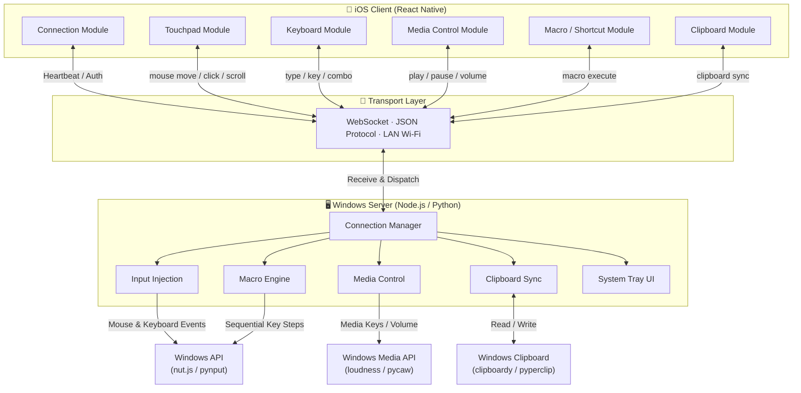

# Nexus — iOS Remote Control for Windows: Development Plan

> **Project Name**: Nexus  
> **Platform**: iOS (React Native) → Windows (Server)  
> **Date**: February 2026  

---

## 1. Project Overview

Nexus is an iOS application that allows users to remotely control a Windows PC over a local Wi-Fi network. Core features include touchpad/mouse simulation, virtual keyboard input, media playback control, custom shortcuts and macro commands, and two-way clipboard synchronization.

---

## 2. System Architecture


---

## 3. Communication Protocol

All communication between client and server uses **WebSocket** with a unified **JSON message format**:
```json
{
  "module": "mouse | keyboard | media | macro | clipboard",
  "action": "action_name",
  "payload": {}
}
```

| Module | Action | Payload Example | Description |
|--------|--------|----------------|-------------|
| `mouse` | `move` | `{ "dx": 10, "dy": -5 }` | Relative cursor movement |
| `mouse` | `click` | `{ "button": "left" }` | Left / right / middle click |
| `mouse` | `scroll` | `{ "dy": -3 }` | Scroll wheel |
| `keyboard` | `type` | `{ "text": "hello" }` | Text input |
| `keyboard` | `key` | `{ "key": "enter" }` | Key press |
| `media` | `control` | `{ "cmd": "play_pause" }` | Play / Pause |
| `macro` | `execute` | `{ "macroId": "open_terminal" }` | Execute a macro |
| `clipboard` | `sync` | `{ "content": "...", "direction": "phone_to_pc" }` | Clipboard sync |

---

## 4. Module Design

### Module 1: Connection Manager

**Responsibility**: Device discovery, pairing, and connection state management

| Feature | iOS Client | Windows Server |
|---------|-----------|---------------|
| Device Discovery | LAN scan / Manual IP input | mDNS broadcast or display IP + port |
| Pairing Auth | Enter pairing code / Scan QR code | Generate pairing code / Display QR code |
| Connection Upkeep | Heartbeat, auto-reconnect | Heartbeat response, timeout disconnect |
| Status Display | Connection status UI indicator | System tray icon state |

**Tech**: Client uses `react-native-websocket`; server uses `ws` (Node.js) or `websockets` (Python). Device discovery via `react-native-zeroconf` (mDNS) or manual IP entry.

---

### Module 2: Touchpad / Mouse Control

**Responsibility**: Translate iOS touch gestures into Windows mouse operations

| Gesture | Mapped Action | Notes |
|---------|--------------|-------|
| Single-finger swipe | Cursor move | Relative offset, adjustable sensitivity |
| Single tap | Left click | — |
| Double tap | Double click | — |
| Two-finger tap | Right click | — |
| Two-finger swipe | Scroll wheel | Vertical + horizontal |
| Three-finger drag | Drag & drop | Hold left button + move |
| Long press | Context menu | — |

**Client**: Use `react-native-gesture-handler`; throttle events to 60–120/sec; apply acceleration curve for natural feel; expose sensitivity slider in settings.

**Server**: Node.js uses `nut.js` or `robotjs`; Python uses `pynput` or `pyautogui`.

---

### Module 3: Virtual Keyboard

**Responsibility**: Provide a virtual keyboard UI to send keystrokes to Windows

| Feature | Description |
|---------|-------------|
| Text Input | Capture system keyboard input, send via WebSocket |
| Function Keys | Esc, F1–F12, Tab, Ctrl, Alt, Win, Delete, etc. |
| Key Combos | Ctrl+C, Ctrl+V, Alt+Tab, etc. |
| Arrow Keys | Up / Down / Left / Right |
| Input Mode | Character-by-character or batch text mode |

**Client**: Use `TextInput` for text capture; custom UI button rows for function keys; modifier keys support a "locked" state for combos.

**Server**: Distinguish between `type` (text injection) and `key` (key event); simulate combos with paired keyDown/keyUp calls.

---

### Module 4: Media Control

**Responsibility**: Control Windows system-level media playback

| Control | Description |
|---------|-------------|
| Play / Pause | System media key |
| Previous / Next Track | System media key |
| Volume Adjust | Increase / Decrease / Mute |
| Now Playing Info | Fetch song title & artist from Windows (advanced) |

**Server**: Send Windows virtual key codes (`VK_MEDIA_PLAY_PAUSE`, etc.); volume control via `loudness` (Node.js) or `pycaw` (Python).

---

### Module 5: Shortcuts / Custom Macros

**Responsibility**: Allow users to define shortcut buttons and macro command sequences

| Feature | Description |
|---------|-------------|
| Preset Shortcuts | Copy, Paste, Undo, Screenshot, Lock Screen, etc. |
| Custom Shortcuts | User-defined key combinations with custom labels |
| Macro Commands | Record a sequence of keystrokes/waits, replay with one tap |
| Shortcut Panel | Customizable button grid with icons and colors |

**Macro Data Structure**:
```json
{
  "macroId": "open_terminal",
  "name": "Open Terminal",
  "icon": "terminal",
  "color": "#4A90D9",
  "steps": [
    { "type": "key_combo", "keys": ["win", "r"], "delay": 0 },
    { "type": "wait", "ms": 500 },
    { "type": "type_text", "text": "cmd", "delay": 0 },
    { "type": "key", "key": "enter", "delay": 0 }
  ]
}
```

**Client**: Grid layout panel with drag-to-reorder; macro editor with step management and delay control; persist configs in AsyncStorage.

**Server**: Execute macro steps sequentially with delay support; support macro import/export as JSON files.

---

### Module 6: Clipboard Sync

**Responsibility**: Enable two-way clipboard synchronization between iOS and Windows

| Direction | Trigger | Description |
|-----------|---------|-------------|
| Phone → PC | Manual button / Auto on copy | Send phone clipboard to PC |
| PC → Phone | Manual button / PC copy push | Send PC clipboard to phone |

**Supported Formats**: Plain text (priority); rich text / images (advanced).

**Client**: Use `@react-native-clipboard/clipboard`; provide "Send to PC" and "Get from PC" buttons.

**Server**: `clipboardy` (Node.js) or `pyperclip` (Python); listen for Windows clipboard change events for auto-push.

---

## 5. Tech Stack Summary

| Layer | Technology | Notes |
|-------|-----------|-------|
| **iOS Client** | React Native | Cross-platform, iOS-focused |
| Gesture Handling | react-native-gesture-handler | Touchpad gesture recognition |
| State Management | Zustand or Redux Toolkit | Global app state |
| Local Storage | AsyncStorage | Macro configs and settings |
| Communication | WebSocket | Low-latency bidirectional channel |
| **Windows Server** | Node.js or Python | Choose based on familiarity |
| Input Injection | nut.js / robotjs or pynput | Mouse & keyboard simulation |
| Media Control | loudness or pycaw | System volume control |
| Clipboard | clipboardy or pyperclip | Clipboard read/write |
| Packaging | pkg (Node) or PyInstaller (Python) | Bundle as .exe |

---

## 6. Modular Development Phases

### Phase 0: Project Setup (Week 1)

| Task | Deliverable |
|------|-------------|
| Initialize React Native project | Runnable blank app |
| Initialize Windows server project | Runnable WebSocket server |
| Define communication protocol spec | JSON message format document |
| Set up modular directory structure | Confirmed folder layout |

**Client Directory Structure**:
```
src/
├── modules/
│   ├── connection/      # Module 1: Connection Manager
│   ├── touchpad/        # Module 2: Touchpad
│   ├── keyboard/        # Module 3: Keyboard
│   ├── media/           # Module 4: Media Control
│   ├── macro/           # Module 5: Shortcuts / Macros
│   └── clipboard/       # Module 6: Clipboard
├── components/          # Shared UI components
├── services/            # WebSocket service layer
├── stores/              # State management
└── utils/               # Utility functions
```

**Milestone**: Both ends run independently; directory structure and protocol spec are finalized.

---

### Phase 1: Connection Manager (Week 2)

| Task | Priority |
|------|----------|
| Client: Manual IP connection | P0 |
| Server: WebSocket service startup | P0 |
| Two-way heartbeat mechanism | P0 |
| Auto-reconnect on disconnect | P1 |
| Connection status UI indicator | P1 |
| Pairing code / QR code auth | P2 |

**Milestone**: Client and server establish a WebSocket connection and exchange JSON messages successfully.

---

### Phase 2: Touchpad Module (Week 3)

| Task | Priority |
|------|----------|
| Client: Touch area UI + gesture capture | P0 |
| Server: Mouse movement injection | P0 |
| Single click, double click, right click | P0 |
| Scroll wheel | P1 |
| Sensitivity setting | P1 |
| Three-finger drag | P2 |

**Milestone**: Phone touchpad smoothly controls the Windows cursor with basic click and scroll.

---

### Phase 3: Virtual Keyboard (Week 4)

| Task | Priority |
|------|----------|
| Client: Text input capture and send | P0 |
| Server: Keyboard input injection | P0 |
| Function key row UI | P1 |
| Key combo support | P1 |
| Modifier key lock state | P2 |

**Milestone**: Can type text into PC via phone keyboard and send function/combo keys.

---

### Phase 4: Media Control (Week 5)

| Task | Priority |
|------|----------|
| Client: Media control UI | P0 |
| Server: Send system media keys | P0 |
| Volume slider / buttons | P1 |
| Mute toggle | P1 |
| Display current volume | P2 |

**Milestone**: Can control PC media players (Spotify, YouTube, etc.) and volume from phone.

---

### Phase 5: Shortcuts / Macro Module (Weeks 6–7)

| Task | Priority |
|------|----------|
| Client: Preset shortcut panel | P0 |
| Server: Execute shortcut combos | P0 |
| Custom shortcut create/edit | P1 |
| Macro editor (step sequence) | P1 |
| Server macro execution engine | P1 |
| Panel drag-to-reorder layout | P2 |
| Macro import/export | P2 |

**Milestone**: Users can use preset shortcuts and create custom macros that execute with one tap.

---

### Phase 6: Clipboard Sync (Week 8)

| Task | Priority |
|------|----------|
| Phone → PC: Manual text send | P0 |
| PC → Phone: Manual text fetch | P0 |
| Server: Listen & push PC clipboard changes | P1 |
| Clipboard history list | P2 |
| Image clipboard sync | P2 |

**Milestone**: Two-way plain-text clipboard sync between phone and PC is working.

---

### Phase 7: Integration, Polish & Packaging (Weeks 9–10)

| Task | Priority |
|------|----------|
| Main UI with Tab navigation | P0 |
| Package server as Windows .exe | P0 |
| End-to-end testing & bug fixes | P0 |
| Global settings page (sensitivity, theme) | P1 |
| UI polish and animations | P1 |
| System tray mode + auto-start on boot | P1 |
| Performance optimization (latency, CPU) | P1 |

**Milestone**: A fully functional App + Windows installer ready for daily use.

---

## 7. Development Timeline
```
Week 1     ████ Phase 0: Project Setup + Protocol Design
Week 2     ████ Phase 1: Connection Manager
Week 3     ████ Phase 2: Touchpad / Mouse Module
Week 4     ████ Phase 3: Virtual Keyboard Module
Week 5     ████ Phase 4: Media Control Module
Weeks 6–7  ████████ Phase 5: Shortcuts / Macro Module
Week 8     ████ Phase 6: Clipboard Sync Module
Weeks 9–10 ████████ Phase 7: Integration, Polish & Packaging
```

**Estimated Total Duration**: 10 Weeks

---

## 8. Risks & Mitigations

| Risk | Impact | Mitigation |
|------|--------|-----------|
| High WebSocket latency | Choppy mouse control | Throttle message rate; consider binary protocol over JSON |
| iOS WebSocket drops in background | Connection lost when app minimized | Use iOS background tasks to keep alive; fast reconnect |
| Windows security software blocks input injection | Mouse/keyboard simulation fails | Guide user to whitelist the .exe; use a signed binary |
| React Native gesture performance | Poor touchpad feel | Bridge to native module if necessary |
| iOS clipboard permission alerts (iOS 14+) | Disruptive UX pop-ups | Only access clipboard on explicit user action |

---

## 9. Future Extensions

- **Screen Mirror / Casting**: Stream PC screen to phone
- **File Transfer**: Drag-and-drop files between phone and PC
- **Voice Input**: Speech-to-text input into PC
- **Multi-Device Support**: Connect and switch between multiple PCs
- **macOS Server**: Extend server support to macOS
- **iOS Widget / Shortcuts**: Home screen widget for one-tap macro execution