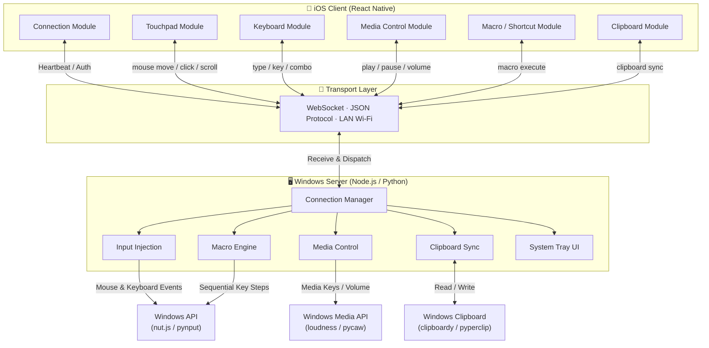

# Nexus — iOS 远程控制 Windows 电脑 开发计划书

> **项目名称**：Nexus  
> **平台**：iOS（React Native）→ Windows（服务端）  
> **日期**：2026年2月  

---

## 一、项目概述

RemoteX 是一款 iOS 应用，允许用户通过局域网（Wi-Fi）远程控制 Windows 电脑。核心功能包括触控板/鼠标模拟、虚拟键盘输入、媒体播放控制、自定义快捷键与宏命令，以及剪贴板双向同步。

---

## 二、整体系统架构


---

## 三、通信协议设计

客户端与服务端之间通过 **WebSocket** 传输 **JSON 消息**，统一格式如下：
```json
{
  "module": "mouse | keyboard | media | macro | clipboard",
  "action": "具体操作名称",
  "payload": {}
}
```

| 模块 | Action | Payload 示例 | 说明 |
|------|--------|-------------|------|
| `mouse` | `move` | `{ "dx": 10, "dy": -5 }` | 相对移动 |
| `mouse` | `click` | `{ "button": "left" }` | 左/右/中键点击 |
| `mouse` | `scroll` | `{ "dy": -3 }` | 滚轮滚动 |
| `keyboard` | `type` | `{ "text": "hello" }` | 文字输入 |
| `keyboard` | `key` | `{ "key": "enter" }` | 按键触发 |
| `media` | `control` | `{ "cmd": "play_pause" }` | 播放/暂停 |
| `macro` | `execute` | `{ "macroId": "open_terminal" }` | 执行宏 |
| `clipboard` | `sync` | `{ "content": "...", "direction": "phone_to_pc" }` | 剪贴板同步 |

---

## 四、功能模块详细设计

### 模块 1：连接管理模块

**职责**：设备发现、配对连接、连接状态维护

| 子功能 | 客户端（iOS） | 服务端（Windows） |
|--------|-------------|-----------------|
| 设备发现 | 局域网扫描 / 手动输入 IP | mDNS 广播 或 显示 IP + 端口 |
| 配对认证 | 输入配对码 / 扫描二维码 | 生成配对码 / 显示二维码 |
| 连接维护 | 心跳检测、自动重连 | 心跳响应、超时断开 |
| 状态提示 | 连接状态 UI 指示 | 系统托盘图标状态 |

**技术选型**：客户端使用 `react-native-websocket`，服务端使用 `ws`（Node.js）或 `websockets`（Python）；设备发现可选 `react-native-zeroconf`（mDNS）或手动输入 IP。

---

### 模块 2：触控板 / 鼠标控制模块

**职责**：将 iOS 触控手势转化为 Windows 鼠标操作

| 手势 | 映射操作 | 说明 |
|------|---------|------|
| 单指滑动 | 鼠标移动 | 相对位移，支持灵敏度调节 |
| 单指单击 | 左键单击 | — |
| 单指双击 | 左键双击 | — |
| 双指单击 | 右键单击 | — |
| 双指滑动 | 滚轮滚动 | 垂直 + 水平滚动 |
| 三指拖动 | 拖拽操作 | 按住左键 + 移动 |
| 长按 | 右键菜单 | — |

**客户端要点**：使用 `react-native-gesture-handler` 捕获手势；数据节流控制在 60–120 次/秒；实现加速度曲线模拟真实触控板手感；提供灵敏度调节设置。

**服务端要点**：Node.js 使用 `nut.js` 或 `robotjs` 注入鼠标事件；Python 使用 `pynput` 或 `pyautogui`。

---

### 模块 3：虚拟键盘模块

**职责**：提供虚拟键盘界面，将按键输入发送至 Windows

| 子功能 | 说明 |
|--------|------|
| 基础文字输入 | 调用系统键盘，文字通过 WebSocket 发送 |
| 功能键区 | Esc、F1–F12、Tab、Ctrl、Alt、Win、Delete 等 |
| 组合键 | Ctrl+C、Ctrl+V、Alt+Tab 等 |
| 方向键 | 上下左右箭头 |
| 输入模式 | 逐字符模式 / 整段文字模式 |

**客户端要点**：基础输入用 `TextInput` 捕获；功能键区为自定义 UI 按钮；组合键支持修饰键「锁定」状态。

**服务端要点**：区分 `type`（文字输入）和 `key`（按键事件）；组合键用 keyDown/keyUp 配对模拟。

---

### 模块 4：媒体控制模块

**职责**：控制 Windows 系统级别的媒体播放

| 控制项 | 说明 |
|--------|------|
| 播放 / 暂停 | 系统媒体键 |
| 上一曲 / 下一曲 | 系统媒体键 |
| 音量调节 | 增加 / 减少 / 静音 |
| 当前播放信息 | 获取歌曲名、艺术家（进阶功能） |

**服务端要点**：使用 Windows 虚拟键码发送媒体键（`VK_MEDIA_PLAY_PAUSE` 等）；音量控制 Node.js 使用 `loudness`，Python 使用 `pycaw`。

---

### 模块 5：快捷键 / 自定义宏模块

**职责**：用户自定义快捷键按钮和宏命令序列

| 子功能 | 说明 |
|--------|------|
| 预设快捷键 | 复制、粘贴、撤销、截图、锁屏等 |
| 自定义快捷键 | 用户录入任意组合键并命名 |
| 宏命令 | 录制按键序列，支持延迟，一键回放 |
| 快捷键面板 | 可自定义布局的按钮网格 |

**宏数据结构**：
```json
{
  "macroId": "open_terminal",
  "name": "打开终端",
  "icon": "terminal",
  "color": "#4A90D9",
  "steps": [
    { "type": "key_combo", "keys": ["win", "r"], "delay": 0 },
    { "type": "wait", "ms": 500 },
    { "type": "type_text", "text": "cmd", "delay": 0 },
    { "type": "key", "key": "enter", "delay": 0 }
  ]
}
```

**客户端要点**：网格布局面板，支持拖拽排列；宏编辑器支持添加步骤和设置延迟；使用 AsyncStorage 本地存储配置。

**服务端要点**：按顺序执行宏步骤，支持延迟控制；支持宏配置导入/导出（JSON 文件）。

---

### 模块 6：剪贴板同步模块

**职责**：实现 iOS 与 Windows 之间的剪贴板双向同步

| 同步方向 | 触发方式 | 说明 |
|---------|---------|------|
| 手机 → 电脑 | 手动按钮 / 复制时自动 | 将手机剪贴板内容发送至 PC |
| 电脑 → 手机 | 手动按钮 / PC 复制时推送 | 将 PC 剪贴板内容发送至手机 |

**支持格式**：纯文本（优先）；富文本 / 图片（进阶）。

**客户端要点**：使用 `@react-native-clipboard/clipboard` 读写剪贴板；提供「发送到电脑」和「从电脑获取」按钮。

**服务端要点**：Node.js 使用 `clipboardy`，Python 使用 `pyperclip`；监听 Windows 剪贴板变化事件自动推送。

---

## 五、技术栈总结

| 层级 | 技术 | 说明 |
|------|------|------|
| **iOS 客户端** | React Native | 跨平台框架（主攻 iOS） |
| 手势处理 | react-native-gesture-handler | 触控板手势识别 |
| 状态管理 | Zustand 或 Redux Toolkit | 全局状态管理 |
| 本地存储 | AsyncStorage | 宏配置、用户设置 |
| 通信 | WebSocket | 低延迟双向通信 |
| **Windows 服务端** | Node.js 或 Python | 按个人熟悉度选择 |
| 输入注入 | nut.js / robotjs 或 pynput | 模拟鼠标键盘 |
| 媒体控制 | loudness 或 pycaw | 系统音量控制 |
| 剪贴板 | clipboardy 或 pyperclip | 剪贴板读写 |
| 打包分发 | pkg (Node) 或 PyInstaller (Python) | 打包为 .exe |

---

## 六、模块化开发阶段规划

### 阶段 0：项目基础搭建（第 1 周）

| 任务 | 交付物 |
|------|--------|
| 初始化 React Native 项目 | 可运行的空白 App |
| 初始化 Windows 服务端项目 | 可运行的 WebSocket 服务 |
| 建立通信协议文档 | JSON 消息格式规范 |
| 搭建模块化目录结构 | 目录结构确认 |

**客户端目录结构**：
```
src/
├── modules/
│   ├── connection/      # 模块1：连接管理
│   ├── touchpad/        # 模块2：触控板
│   ├── keyboard/        # 模块3：键盘
│   ├── media/           # 模块4：媒体控制
│   ├── macro/           # 模块5：快捷键/宏
│   └── clipboard/       # 模块6：剪贴板
├── components/          # 公共 UI 组件
├── services/            # WebSocket 服务层
├── stores/              # 状态管理
└── utils/               # 工具函数
```

**里程碑**：两端项目可独立运行，目录结构与协议规范确认完毕。

---

### 阶段 1：连接管理模块（第 2 周）

| 任务 | 优先级 |
|------|--------|
| 客户端：手动输入 IP 连接 | P0 |
| 服务端：WebSocket 服务启动与监听 | P0 |
| 双向心跳机制 | P0 |
| 断线自动重连 | P1 |
| 连接状态 UI 指示 | P1 |
| 配对码 / 二维码认证 | P2 |

**里程碑**：客户端与服务端成功建立 WebSocket 连接，能互发 JSON 消息。

---

### 阶段 2：触控板模块（第 3 周）

| 任务 | 优先级 |
|------|--------|
| 客户端：触控区域 UI + 手势捕获 | P0 |
| 服务端：鼠标移动注入 | P0 |
| 单击、双击、右键 | P0 |
| 滚轮滚动 | P1 |
| 灵敏度设置 | P1 |
| 三指拖拽 | P2 |

**里程碑**：手机触控区域可流畅控制 Windows 鼠标光标，能执行基本点击和滚动。

---

### 阶段 3：虚拟键盘模块（第 4 周）

| 任务 | 优先级 |
|------|--------|
| 客户端：文字输入捕获与发送 | P0 |
| 服务端：键盘输入注入 | P0 |
| 功能键区 UI | P1 |
| 组合键支持 | P1 |
| 修饰键锁定状态 | P2 |

**里程碑**：可通过手机键盘向 PC 输入文字，并能发送功能键和组合键。

---

### 阶段 4：媒体控制模块（第 5 周）

| 任务 | 优先级 |
|------|--------|
| 客户端：媒体控制 UI | P0 |
| 服务端：系统媒体键发送 | P0 |
| 音量滑块 / 按钮 | P1 |
| 静音切换 | P1 |
| 显示当前音量 | P2 |

**里程碑**：可通过手机控制 PC 上 Spotify/YouTube 等播放器的播放和音量。

---

### 阶段 5：快捷键 / 宏模块（第 6–7 周）

| 任务 | 优先级 |
|------|--------|
| 客户端：预设快捷键面板 | P0 |
| 服务端：执行快捷键组合 | P0 |
| 自定义快捷键创建/编辑 | P1 |
| 宏命令编辑器（步骤序列） | P1 |
| 服务端宏执行引擎 | P1 |
| 面板自定义布局（拖拽排序） | P2 |
| 宏导入/导出 | P2 |

**里程碑**：用户可使用预设快捷键，并能自定义创建宏命令一键执行。

---

### 阶段 6：剪贴板同步模块（第 8 周）

| 任务 | 优先级 |
|------|--------|
| 手机 → 电脑：手动发送文本 | P0 |
| 电脑 → 手机：手动获取文本 | P0 |
| 服务端监听 PC 剪贴板变化并推送 | P1 |
| 剪贴板历史记录 | P2 |
| 图片剪贴板同步 | P2 |

**里程碑**：手机和 PC 之间可双向同步剪贴板文本内容。

---

### 阶段 7：整合优化与打包（第 9–10 周）

| 任务 | 优先级 |
|------|--------|
| 主界面整合 Tab 导航 | P0 |
| 服务端打包为 .exe 安装包 | P0 |
| 端到端测试与 Bug 修复 | P0 |
| 全局设置页面（灵敏度、主题等） | P1 |
| UI 美化与交互动画 | P1 |
| 系统托盘运行 + 开机自启 | P1 |
| 性能优化（延迟、CPU 占用） | P1 |

**里程碑**：完整可用的 App + Windows 安装包，可供日常使用。

---

## 七、开发时间线总览
```
第1周    ████ 阶段0：项目搭建 + 协议设计
第2周    ████ 阶段1：连接管理模块
第3周    ████ 阶段2：触控板/鼠标模块
第4周    ████ 阶段3：虚拟键盘模块
第5周    ████ 阶段4：媒体控制模块
第6–7周  ████████ 阶段5：快捷键/自定义宏模块
第8周    ████ 阶段6：剪贴板同步模块
第9–10周 ████████ 阶段7：整合优化与打包
```

**预计总工期**：10 周

---

## 八、风险与注意事项

| 风险 | 影响 | 应对方案 |
|------|------|---------|
| WebSocket 延迟高 | 鼠标操作不流畅 | 优化消息频率、使用二进制协议替代 JSON |
| iOS 后台 WebSocket 断连 | App 切后台后失去连接 | iOS 后台任务保活、快速重连机制 |
| Windows 输入注入被安全软件拦截 | 鼠标/键盘模拟失败 | 引导用户添加白名单、使用签名的 .exe |
| React Native 手势性能瓶颈 | 触控板体验差 | 必要时使用原生模块桥接 |
| iOS 剪贴板权限限制 | iOS 14+ 访问提示干扰体验 | 仅在用户主动操作时读取剪贴板 |

---

## 九、未来扩展方向

- **屏幕镜像 / 投屏**：截屏串流显示 PC 画面
- **文件传输**：手机与 PC 之间拖拽传文件
- **语音输入**：手机语音转文字输入到 PC
- **多设备支持**：同时连接和切换多台电脑
- **macOS 服务端**：扩展支持 macOS 被控端
- **iOS Widget / 快捷指令**：桌面小组件一键执行宏命令